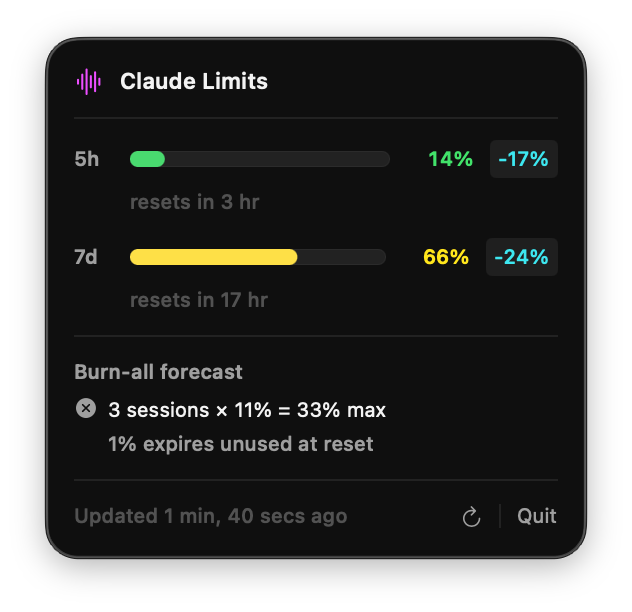

# ClaudeTray

A macOS menu bar app that monitors your [Claude Code](https://claude.ai/code) usage limits in real time, with a focus on **keeping your burn pace matched to your available budget**.



## How it works

ClaudeTray reads the OAuth access token that Claude Code stores in the macOS Keychain, then calls the Anthropic usage API (`/api/oauth/usage`) to fetch your current utilisation for both windows. No separate login or API key needed — if Claude Code is signed in, ClaudeTray will work.

## Why

Claude Code enforces two rolling rate limits: a **5-hour session window** and a **7-day weekly window**. Knowing raw utilisation (e.g. "64%") tells you how much you've used, but not whether you're on track. If half the week has passed and you've only used 20%, you have budget to burn. If you're at 20% with only one 5-hour window left before the week resets, you're in good shape. ClaudeTray surfaces this at a glance.

## Features

| What                            | How                                                                                                                                                                                        |
| ------------------------------- | ------------------------------------------------------------------------------------------------------------------------------------------------------------------------------------------ |
| **5h pace** in the menu bar     | Signed `+X%` / `-X%` vs. linear rate through the current 5-hour window — the primary signal                                                                                                |
| **Colour-coded dot**            | Green (under pace) → Yellow → Orange → Red (burning fast)                                                                                                                                  |
| **Both windows** in the popover | Progress bars for the 5h and 7d windows, each with their own pace badge                                                                                                                    |
| **Burn-all forecast**           | Shows how many full 5-hour sessions remain before the weekly reset and whether you can exhaust your weekly budget — based on the model that one maxed-out 5h session ≈ 11% of weekly usage |
| **Auto-refresh**                | Polls every 2 minutes; manual refresh button always available                                                                                                                              |
| **Keychain auth**               | Reads the OAuth token that Claude Code already stores — no API key setup required                                                                                                          |

### Reading the pace value

The pace delta is `utilisation% − (time_elapsed / window_duration × 100)`.

- **`-20%`** — you've used 20 percentage points less than the linear rate. Budget headroom remains.
- **`+20%`** — you're 20 points ahead of pace. You'll hit the limit before the window ends at this rate.

The burn-all forecast uses 11% per 5-hour session as the maximum weekly burn rate:

```
sessions_left   = floor(hours_until_weekly_reset / 5)
max_burnable    = sessions_left × 11%
can_exhaust     = max_burnable ≥ weekly_remaining
```

If you can't exhaust the limit, the forecast shows how much budget will expire unused.

> **Note:** The burn-all forecast is a rough reference estimate, not an exact prediction. It assumes every 5-hour session is maxed out at exactly 11% of weekly usage, which varies in practice. Use it as a directional signal — not a guarantee.

## Requirements

- macOS 13 Ventura or later
- [Claude Code](https://claude.ai/code) installed and signed in (provides the Keychain credentials)
- Swift 5.9+ (ships with Xcode 15+)

## Build & Run

```bash
# Build
swift build -c release

# Run
.build/release/ClaudeTray
```

On first launch, macOS will prompt for Keychain access — choose **Always Allow**.

### Auto-start on login

```bash
cp .build/release/ClaudeTray /usr/local/bin/ClaudeTray
```

Then add `/usr/local/bin/ClaudeTray` as a Login Item in  
**System Settings → General → Login Items & Extensions**.

## License

ClaudeTray is released under the [MIT License](LICENSE). Feel free to use, modify, and distribute it — just keep the license notice intact.
