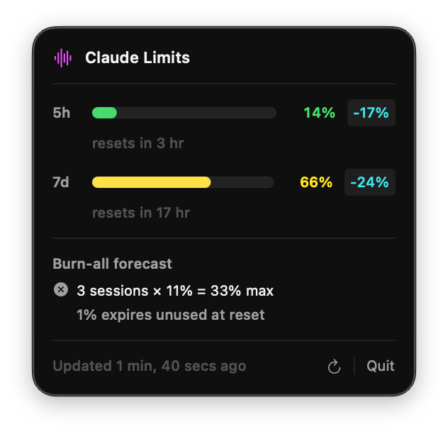

# ClaudeTray

A macOS menu bar app that monitors your [Claude Code](https://claude.ai/code) usage limits in real time, with a focus on **keeping your burn pace matched to your available budget**.



## How it works

ClaudeTray reads the OAuth access token that Claude Code stores in the macOS Keychain, then calls the Anthropic usage API (`/api/oauth/usage`) to fetch your current utilisation for both windows. No separate login or API key needed — if Claude Code is signed in, ClaudeTray will work.

## Why

Claude Code enforces two rolling rate limits: a **5-hour session window** and a **7-day weekly window**. Knowing raw utilisation (e.g. "64%") tells you how much you've used, but not whether you're on track. If half the week has passed and you've only used 20%, you have budget to burn. If you're at 20% with only one 5-hour window left before the week resets, you're in good shape. ClaudeTray surfaces this at a glance.

## Features

| What                            | How                                                                                                                                                                                        |
| ------------------------------- | ------------------------------------------------------------------------------------------------------------------------------------------------------------------------------------------ |
| **5h pace** in the menu bar     | Signed `+X%` / `-X%` vs. linear rate through the current 5-hour window — the primary signal                                                                                                |
| **Colour-coded dot**            | Green (under pace) → Yellow → Orange → Red (burning fast)                                                                                                                                  |
| **Both windows** in the popover | Progress bars for the 5h and 7d windows, each with their own pace badge                                                                                                                    |
| **Burn-all forecast**           | How many sessions it takes to exhaust your weekly budget, how many still fit before the reset, and when you'd hit the limit — counting the current session's leftover share and skipping the hours you're asleep |
| **Expandable session plan**     | "Show plan" lists the schedule: when each session starts, how much budget it burns, and what's left afterwards                                                                                                  |
| **Reset notifications**         | Sends a push notification when the 5-hour or 7-day window resets                                                                                                                           |
| **Smart polling**               | Skips API calls while the 5h session is maxed — nothing changes until the window resets                                                                                                    |
| **Resilient on errors**         | On rate-limit (429) or server errors, old values stay visible; a warning appears in the footer rather than replacing your data                                                             |
| **Auto-refresh**                | Polls every 10 minutes, wakes exactly when a window resets, and refreshes on popover open when data is stale; manual refresh button always available                                       |
| **Keychain auth**               | Reads the OAuth token that Claude Code already stores — no API key setup required                                                                                                          |

### Reading the pace value

The pace delta is `utilisation% − (time_elapsed / window_duration × 100)`.

- **`-20%`** — you've used 20 percentage points less than the linear rate. Budget headroom remains.
- **`+20%`** — you're 20 points ahead of pace. You'll hit the limit before the window ends at this rate.

The burn-all forecast walks forward through the 5-hour windows between now and the weekly reset, spending budget as it goes:

- A maxed 5-hour session burns about **11%** of the weekly budget.
- The window you're **already in** only counts for the share it hasn't spent yet — full-value sessions start once it resets.
- You're assumed **asleep from midnight to 06:00**: sessions aren't started during those hours, and one that runs into them only burns the fraction you're awake for. A session from 22:00 therefore contributes ~4.4%, not 11%.

The walk stops when the budget runs out — the forecast then reports when you'd hit the limit — or when no further session fits before the weekly reset, in which case it reports how much expires unused. "Show plan" lists the resulting schedule.

> **Note:** This is a rough reference estimate, not a prediction. It assumes you max out every session at exactly 11% of the weekly budget, which varies in practice, and that your sleep matches the window above. Use it as a directional signal — not a guarantee.

## Requirements

- macOS 13 Ventura or later
- [Claude Code](https://claude.ai/code) installed and signed in (provides the Keychain credentials)
- Swift 5.9+ (ships with Xcode 15+)

## Don't want to build it yourself?

Ironic as it sounds — just open Claude Code and ask it to run `bash build-app.sh` for you. It built this whole thing already, it won't mind.

## Build & Run

Use the included script to build a proper `.app` bundle (required for push notifications):

```bash
bash build-app.sh
open dist/ClaudeTray.app
```

This compiles the binary with `swift build -c release` and wraps it in `dist/ClaudeTray.app` with the necessary `Info.plist`. The `dist/` directory is gitignored.

On first launch, macOS will prompt for Keychain access — choose **Always Allow**. If you want reset notifications, also allow the notification permission prompt.

### Auto-start on login

Copy the app to your Applications folder and add it as a Login Item:

```bash
cp -r dist/ClaudeTray.app /Applications/ClaudeTray.app
```

Then go to **System Settings → General → Login Items & Extensions** and add `/Applications/ClaudeTray.app`.

## License

ClaudeTray is released under the [MIT License](LICENSE). Feel free to use, modify, and distribute it — just keep the license notice intact.
